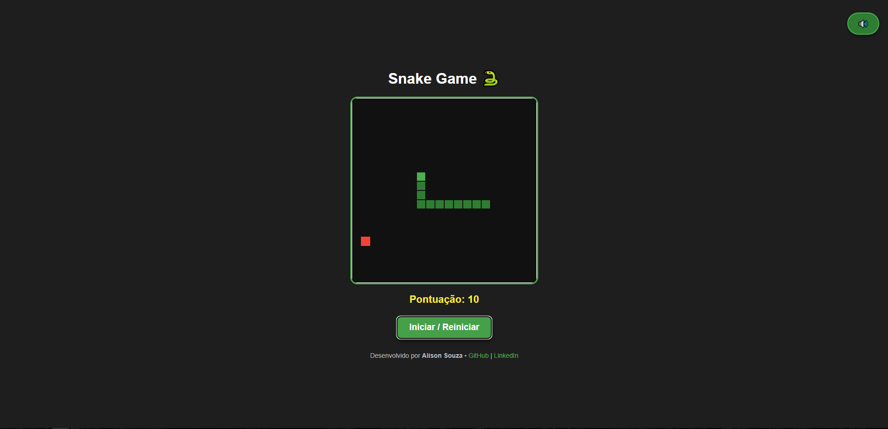

# Snake Game 🐍


## 💻 Preview



Um clássico jogo da cobrinha recriado em **JavaScript, HTML e CSS**, com visual moderno, sons, música de fundo e ranking de pontuações.

---

## 🎮 Funcionalidades

- [x] Cobra que se movimenta nas 4 direções (setas do teclado)
- [x] Comida gerada aleatoriamente
- [x] Pontuação exibida em tempo real
- [x] Velocidade da cobra aumenta a cada 5 pontos
- [x] Sons: movimento, comer e game over
- [x] Música de fundo com botão de **mute**
- [x] Tela de **Game Over** com ranking das 5 maiores pontuações
- [x] Reinício do jogo com botão ou tecla **Espaço**
- [x] Layout responsivo e estilizado
- [x] Footer com GitHub e LinkedIn do desenvolvedor

---

## 🛠 Tecnologias utilizadas

- HTML5
- CSS3
- JavaScript (ES6+)
- Canvas API
- LocalStorage

---

## ▶ Como jogar

Siga estes passos para rodar o jogo localmente:

1. Clone o repositório:

```bash
git clone https://github.com/alison-souza/snake-game.git
```

2. Entre na pasta do projeto:

```bash
cd snake-game
```

3. Abra o `index.html` no navegador.
4. Clique no botão **Iniciar / Reiniciar** para começar.
5. Use as **setas do teclado** para controlar a cobra.
6. Coma a comida vermelha para ganhar pontos.
7. Evite colidir com as paredes ou com o próprio corpo.
8. Para silenciar ou ativar a música, clique no botão 🔊 no canto superior direito.
9. Após o **Game Over**, veja a pontuação e o ranking top 5. Pressione **Espaço** ou **Iniciar** para jogar novamente.

---

## 📂 Estrutura do projeto

```text
snake-game/
│
├── icons/
├── assets/
├── index.html
├── style.css
├── script.js
├── sounds/
│ ├── move.mp3
│ ├── eat.mp3
│ ├── gameover.mp3
│ └── music.mp3
└── README.md
```
